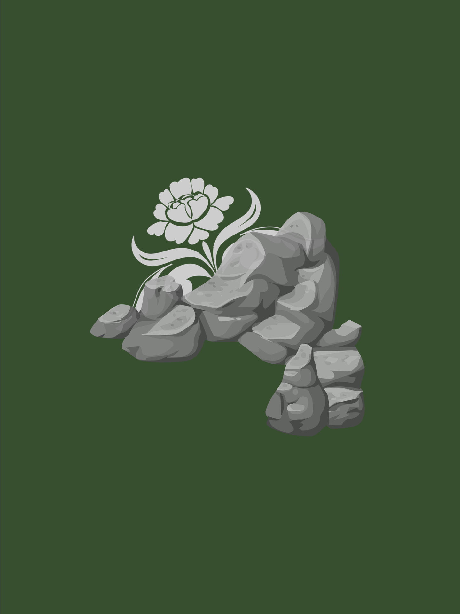

    <figure>
        
    </figure>

# Order of the Sacred Earth

Legitimized by the Emperor just before his illness, The Order of the Sacred Earth is not solely comprised of elves or druids, despite what the name might imply. It accepts any who are willing to commit themselves to a life in balance with nature. Their idealogy surrounds cultivation of the natural environment in a way that allows the sentient races of the plane to exist comfortably without destroying the very source of that life and comfort. They are not afraid to take up arms to support that balance, and have come to the Agate Coast both to defend its natural beauty from those who would ravage it and seeking the power to do so. Their respect for the environment has enabled to reach further into the peninsula than any other organization.

### Key Individuals
- Named
  - Laeroth Yllaren - Elven ranger, sent to the Broken Gulf Sailing Co. camp to hire adventurers to save a missing ranger. Speaks elvish.
  - Cordrick - The missing ranger, who has been gone for a fortnight, longer than expected for what should have been a six day adventure.
  - Khargra - An elderly orc, presumed to be the captain of the armed portion of the Order's camp. He is Cordrick's father. He bears a gem amulet of sending bearing the crest of the Order that connects to the wooden amulets the various guards carry. He granted the party a tracking blessing after they agreed to find his son. He is presumed to be in a relationship with the camp cook, Cordrick's mother.
  - Tylis - A young human ranger, he is currently blacklisted for starting a drunken brawl with the Shining Swords the night before he was supposed to accompany his cousin Cordrick in search of a landmark they observed on a previous patrol. The drunkenness and the brawl caused him to oversleep, and Cordrick left without him. He is accompanying the party as a guide to the landmark in question as part of his penance. He carries an elegant sword.
  - Ailathana - An elderly elvish lady, appears to be the highest ranking member of the Order in the Agate Coast camp.
  - Heleda - The human camp cook, she is Cordrick's mother, and is restricting Tylis' meals to bread and water as additional punishment for losing her son.
- Unnamed
  - The camp quartermaster is a harried aarakocran. He complained about frequent commands instructing him to supply adventurers without explicitly promising payment from the Order.
  - Two guards at the entrance of the camp, bearing wooden amulets of sending bearing the crest of the Order.
  - Two guards at the base of the command tree, bearing wooden amulets of sending bearing the crest of the Order.

### Key Locations
- Agate Coast
  - Forest Camp
    - Guarded entrance. There is a path lit with multicolored glowing magic lanterns. The lanterns are designed and placed to inhibit night vision and darkvision to obscure the camp beyond, and hold enchantments emitting a flower-scented fog that dulls the senses.
    - A large central bonfire immediately adjacent to the command tree serves as a communal gathering space where members of the Order gather for meals and community.
    - Directly north of the bonfire is the command tree. It is ringed by shrines to all of the aspects (gods). The Night aspects are presented on the southern side of the tree, by the staircase. The Day aspects are behind the tree, on the northern side. All the altars are consecrated. The altar to Ashamariya (Astrimara?) is closest to the stairs.
  - Glittering Dome
    - Distant landmark spotted by Tylis and Cordrick on a recent patrol. It is three days travel north of the Order's camp and one day further than their normal patrol distance.
    - Dome is a perfect hemisphere, 20 ft tall, visibly duotone black and red. The joint forms a perfect vertical seam.
    - Exterior:
      - Was covered in vines on initial contact, now cleared.
      - Black stone marbled with white veins, red stone marbled with yellow veins.
      - Unique runes at top, sun carved into the red marble, moon in black.
      - Covered in runes: "May the Sun be illuminated/and the Moon shine bright/as the Guardian [Father] watches over the Mother's rest."
      - Broad translation of the remainder says:
        - Black: Blessed site/site of conferring blessing when given offerings, when going below/love poetry.
        - Red: Entrance is at the seam between the sides, the key is at the top, hold light to the unique runes there.
      - Associated rolls:
        - Religion 20: Sacred religious site, associated with the Mother and Father (precursors to the aspects).
            - Mother is precursor to the Night pantheon, associated with black/white and the moon.
            - Father is precursor to the Day pantheon, associated with red/yellow and the sun.
        - History 9: Warmbread's Elders use similar symbols to the runes.
        - History 16: Site is incredibly old, pre-banishing. Hints of historical significance.
        - Arcana 9: Runes are magical, linguistic predecessors of current runes in books.
        - Nature ??: Current phase of the moon is crescent.
        - Nature ??: There are no insects in the entire clearing.
    - Interior:
      - 1st room, hexagonal.
        - SW wall: Staircase down from opening in dome.
        - SE wall: Nothing.
        - East wall: Shelves + low stone basin.
        - NE wall: Recessed stone shelf.
        - North corner: Curtain covering hallway.
        - NW wall: Desk + chair offset from wall, facing center of the room.
        - West wall: Chest underneath stairs.
          - 12 antique gold coins.
          - Magic item: Net of silver thread, requires attunement.
        - Floor is still duotone, veining is thicker here and all runs to the hallway.
      - Hallway, runs North-South, dusty curtains at both ends.
        - Veins run lengthwise.
        - Very old skeletons in hallway, reaching for curtain leading to 1st room. (Removed before we departed)
        - All have smashed skulls.
        - Investigation/Perception ??: Recent footprints leading towards 2nd room.
      - 2nd room, round.
        - Large well in the center, Cordrick is asleep against well.
        - Veins split to altars on the sides, Night Mother on west wall, Sun Father on east side. Crystals grow from the altars.
        - North wall contains a small fountain.
        - Associated rolls:
          - Investigation ??: Sun Father altar contains a small hollow (OOC Knowledge: hollow contains a temple guardian.)
          - Investigation ??: Foutain on north wall feeds central well through the floor.
          - Religion ??: Lighting a candle from the shelves in the 1st room and placing it at an altar grants blessing (1d4 inspiration die).
          - Religion ??: Altars can be used to communicate with your god of the associated pantheon, connection is a bit murky.
        - Runes on the central well read: "Offer what flows free/to give the Mother who wakes/and the Guardian who waits/repreive."
          - Pouring the holy water on the shrines causes the veins to glow.
        - Cordrick drank the water before offering to the shrines, magically slept as punishment.

### Notes
- Contract w/Ailathana for return of Cordrick (or his body)
  - 8 GP (disbursed as 70 SP + 100 CP, carried by Kharmira)
  - 10 days of rations per party member
  - Unfettered access to land defended and patrolled by the Order for the entire party (so long as the party does not act against the interests of the Order)
  - An additional 12 GP per party member on completion of the mission.
  - A map was also given, which Redimir is adding to during travel to the landmark.
    - Rolls 15 to add detail to known territory on first day. Camp is made under a large white tree at an established campsite used by patrols. There is a shrine to Tulier (Day aspect of travelers).
    - Rolls 8 to add detail to known territory first half second day. Tokka briefly got the party lost, receovered by finding a creek where the party was able to refill water.
    - Rolls 20 to add detail to known territory second half second day. Camp is made at the top of the ridge marking the furthest border of patrolled territory. The glittering dome is just barely in sight.
    - Rolls 10 to add unknown territy to map first half third day. Arrived at the glittering dome.
