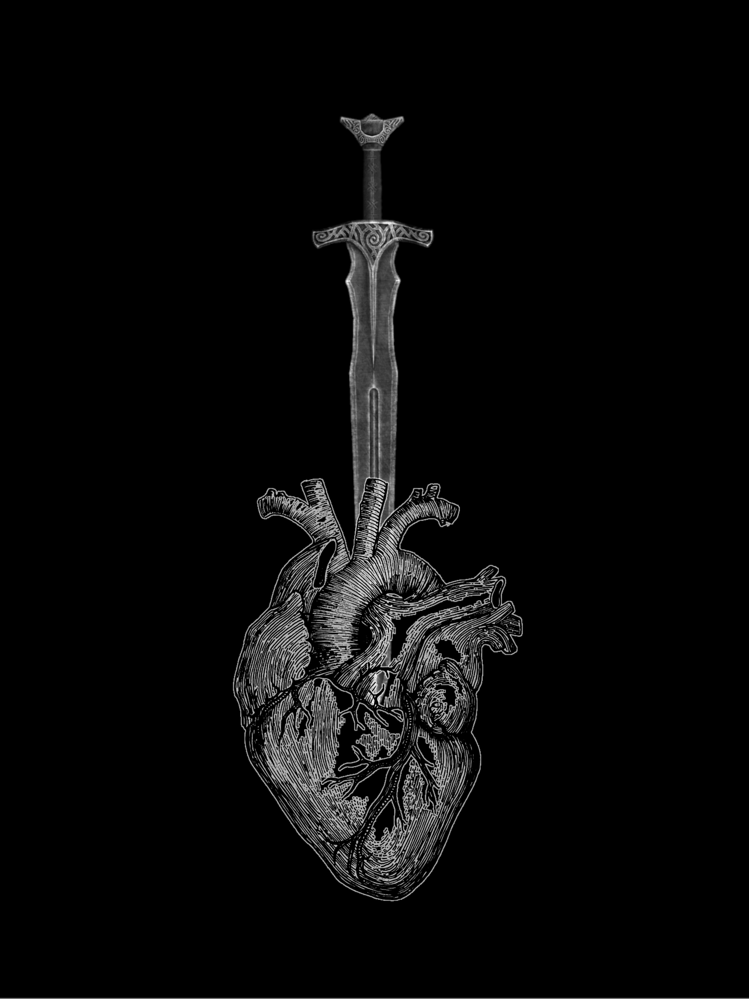

    <figure>
        
    </figure>

# The Shining Swords

The Shining Swords is a mercenary company best avoided unless you have enough coin to pay them - and the skill to keep them from taking it before they complete whatever task you ask of them. Their presence on the Agate Coast is clearly profit motivated, but their quarrel with the Order of the Sacred Earth has consumed quite a bit of their attention and resources.

### Key Individuals
- Named
  - Seaweed - Kobold who works the ferry crossing to the Black Fortress. Warmbrad gave him a silver and told him he should be treated better by the Shining Swords.
  - Stickface - Kobold working the path up to the Black Fortress. Had a desk and a tent that blew away. Pushes adventurers to sign a hold harmless agreement for the Shining Swords that includes the local membership clause: surviving the Black Fortress and bringing loot back to prove it.
  - Sir Pereret Genric - A tall older human with graying red hair in full plate and sporting the holy symbol of Xarius, king of the day aspects. Sir Genric is the knight and noble in charge of the Shining Swords mercenary company, and well respected despite the terrible reputation of his son. He contracted with the party to escort Lady Lysandra upriver and to spy on her during the expedition.
  - Sir Galaird Genric - The son of Sir Pereret Genric, he is known as 'Sir Shiny' as his armor constantly gleams from lack of use.
  - Samwell - A young human squire to Sir Genric, about age 12. He is in constant awe of knights like Sir Genric and Redimir, and also Warmbread for his ability to capture the native lizards. The night after he met the party, he stayed up the whole night to catch one himself.

### Key Locations
- Agate Coast
  - Beach Camp
    - Collection of smaller camps, as of smaller bands of mercenaries hired under the Shining Swords banner; all of them are arranged around a central command tent and a makeshift forge (where Warmbread is employed while the rest of the party escort and later hunt Lady Lysandra upriver).
    - Whole camp smells of iron and woodsmoke.
    - The camp wakes much earlier than the Broken Gulf Sailing Co. to train.
    - The command tent is thickly curtained but well-lit by ship's lanterns and has boards for floors. It is enchanted for protection against spying, scrying, and eavesdropping.
    - The center of the command tent is dominated by Sir Genric's desk, which is covered with maps and rosters, and had a letter with the imperial crest at the time of the party's meeting with him. The tent has few other decorations.
  - Black Fortress
    - Shining Swords had laid claim to it originally, sending mercenaries and potential recruits in to try to claim it (recruits who survived were granted membership).
    - After being cleared by the party, the Swords claim is superceded by the godly claim.
